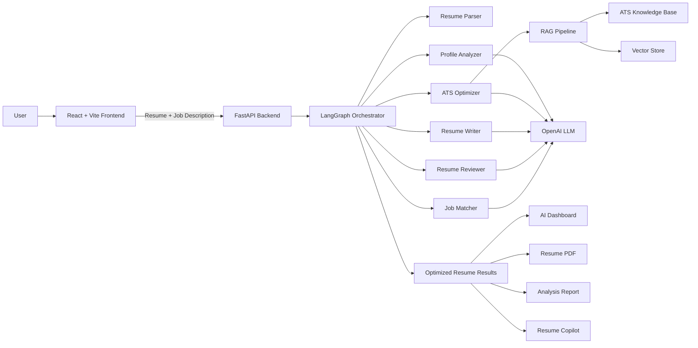

# 🚀 Enterprise AI Resume Generator

An Agentic AI-powered resume optimization platform that analyzes resumes, evaluates ATS compatibility, compares candidate skills with job descriptions, generates optimized resume content, and provides AI-driven recommendations.

The application uses a multi-agent workflow powered by LangGraph, FastAPI, React, RAG, and Large Language Models.

---

## ✨ Key Features

- 📄 PDF and DOCX resume upload
- 🧠 AI-powered resume parsing
- 👤 Candidate profile analysis
- 🎯 ATS compatibility scoring
- 🔍 Missing keyword identification
- 💼 Job description matching
- ✍️ AI resume content generation
- 📊 Resume quality review
- 🔄 Original vs optimized resume comparison
- 💡 Personalized AI recommendations
- 🤖 Interactive Resume Copilot
- 📥 Optimized resume PDF download
- 📑 AI analysis report generation
- ⚡ Multi-agent workflow orchestration
- 📚 RAG-based ATS knowledge retrieval

---

## 🖥️ Application Screenshots

### Landing Page


---

### Resume Upload & Job Description

Upload a PDF/DOCX resume and provide the target job description to start the AI-powered optimization workflow.


---

### AI Resume Dashboard

The dashboard provides a quick overview of ATS compatibility, job match, resume quality, and candidate experience.


---

### AI Recommendations

AI-generated recommendations highlight missing skills, ATS improvements, and actions that can improve the candidate's resume.


---

### Resume Comparison

Compare the original resume with the AI-optimized version before downloading the final resume.


---

### AI Resume Copilot

The Resume Copilot allows users to interact with AI and request additional resume improvements.


---

### Multi-Agent Workflow

The application uses specialized AI agents coordinated through LangGraph for resume parsing, profile analysis, ATS optimization, resume generation, review, and job matching.


---

## 🧠 Multi-Agent Architecture

The application uses specialized AI agents coordinated through LangGraph.

```text
Resume Upload
      │
      ▼
Resume Parser
      │
      ▼
Profile Analyzer
      │
      ▼
ATS Optimizer
      │
      ▼
Resume Writer
      │
      ▼
Resume Reviewer
      │
      ▼
Job Matcher
      │
      ▼
Optimized Resume

## 🏗️ System Architecture



### Architecture Overview

The platform follows a full-stack Agentic AI architecture:

**React Frontend → FastAPI API → LangGraph Orchestration → Specialized AI Agents → RAG + LLM → Resume Analysis & Generation**

Each AI agent is responsible for a specific stage of resume processing, while LangGraph coordinates the overall workflow.